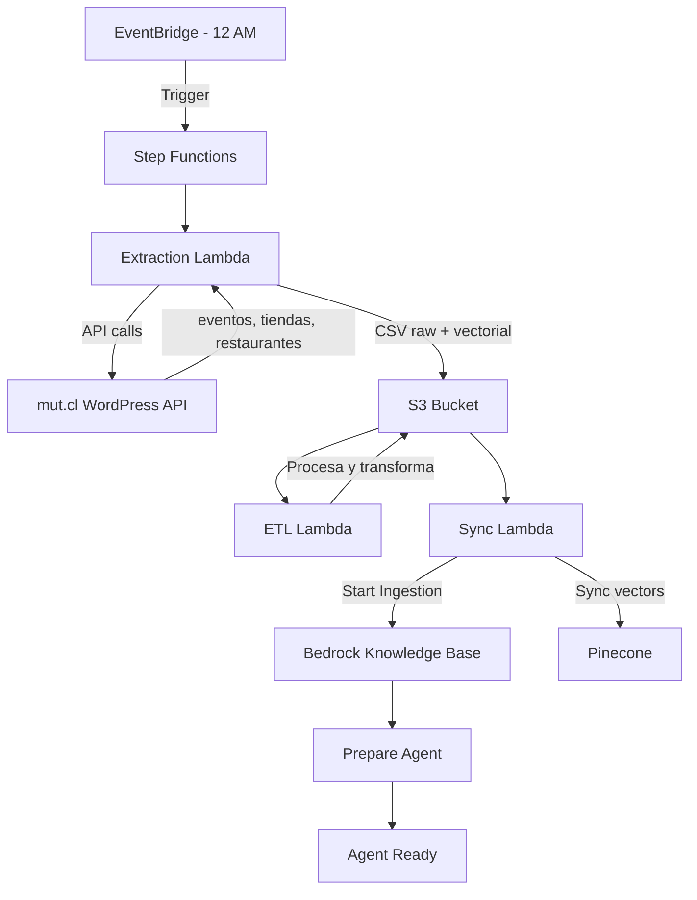

# Pipeline Automático de Datos - Arquitectura

## 📋 Descripción General

Sistema automatizado para extracción, procesamiento y sincronización de datos vectoriales desde la API de mut.cl hacia el Knowledge Base de Amazon Bedrock.

## 🏗️ Arquitectura de los Nuevos Stacks

### 1. **DataExtractionLambdaStack** 
📁 `stack_lambda_extraction/`

**Propósito:** Extrae datos desde la API de WordPress de mut.cl

**Funcionalidad:**
- Extrae eventos desde `/wp-json/wp/v2/event`
- Extrae tiendas desde `/wp-json/wp/v2/stores`
- Extrae restaurantes desde `/wp-json/wp/v2/restaurant`
- Prepara datos en formato vectorial optimizado
- Guarda archivos CSV en S3 (`raw/` y `vectorial/`)

**Recursos:**
- Lambda Function: 2GB RAM, 15 min timeout
- Runtime: Python 3.12
- Dependencies: requests, pandas, boto3

**Outputs:**
- Raw data: `s3://raw-virtual-assistant-data-{account}-{region}/raw/`
- Vectorial data: `s3://raw-virtual-assistant-data-{account}-{region}/vectorial/`

---

### 2. **VectorialSyncLambdaStack**
📁 `stack_lambda_sync_vectorial/`

**Propósito:** Sincroniza datos vectoriales con Pinecone y Knowledge Base

**Funcionalidad:**
- Lee archivos vectoriales desde S3
- Inicia ingestion job en Bedrock Knowledge Base
- Sincroniza con base de datos vectorial Pinecone
- Prepara el agente Bedrock con datos actualizados

**Recursos:**
- Lambda Function: 2GB RAM, 15 min timeout
- Runtime: Python 3.12
- Permisos: Bedrock, S3, Secrets Manager

**Variables de Entorno:**
- `KNOWLEDGE_BASE_ID`: ID del Knowledge Base
- `AGENT_ID`: ID del Agente Bedrock
- `PINECONE_INDEX`: Nombre del índice Pinecone

---

### 3. **DataPipelineOrchestratorStack**
📁 `stack_stepfunctions_orchestrator/`

**Propósito:** Orquesta el pipeline completo mediante Step Functions

**Flujo de Ejecución:**

```
┌─────────────────────┐
│ 1. Extraction       │
│    Lambda           │
│    (Extrae datos)   │
└──────────┬──────────┘
           │
           ▼
┌─────────────────────┐
│ 2. ETL Lambda       │
│    (Procesa datos)  │
└──────────┬──────────┘
           │
           ▼
┌─────────────────────┐
│ 3. Sync Lambda      │
│    (Sincroniza KB)  │
└──────────┬──────────┘
           │
           ▼
      ✅ Success
```

**EventBridge Schedule:**
- **Horario:** Todos los días a las 12:00 AM (hora Chile)
- **Cron Expression:** `cron(0 3 * * ? *)` (3 AM UTC = 12 AM Chile UTC-3)

**Características:**
- Manejo de errores con catch blocks
- Timeout total: 60 minutos
- Retry automático en fallos de servicio

---

## 🚀 Despliegue

### Prerequisitos

```bash
# 1. Instalar dependencias de Python para los Lambdas
cd stack_lambda_extraction/lambda
pip install -r requirements.txt -t .

cd ../../stack_lambda_sync_vectorial/lambda
pip install -r requirements.txt -t .
cd ../..
```

### Deploy Individual

```bash
# Deploy stack de extracción
cdk deploy DataExtractionLambdaStack

# Deploy stack de sincronización
cdk deploy VectorialSyncLambdaStack

# Deploy stack de orquestación (incluye EventBridge)
cdk deploy DataPipelineOrchestratorStack
```

### Deploy Completo

```bash
# Deploy todos los stacks nuevos
cdk deploy DataExtractionLambdaStack VectorialSyncLambdaStack DataPipelineOrchestratorStack

# O deploy de toda la aplicación
cdk deploy --all
```

---

## 🔧 Configuración

### Variables en `stack_lambda_extraction`

```python
S3_BUCKET_NAME: raw-virtual-assistant-data-{account}-{region}
S3_RAW_PREFIX: raw/
S3_VECTORIAL_PREFIX: vectorial/
API_BASE_URL: https://mut.cl/wp-json/wp/v2
```

### Variables en `stack_lambda_sync_vectorial`

```python
KNOWLEDGE_BASE_ID: {kb_id} (desde bedrock_stack)
AGENT_ID: {agent_id} (desde bedrock_stack)
PINECONE_INDEX: agente
```

---

## 📊 Monitoreo

### CloudWatch Logs

**Extraction Lambda:**
```
/aws/lambda/DataExtractionLambdaStack-*
```

**Sync Lambda:**
```
/aws/lambda/VectorialSyncLambdaStack-*
```

**Step Functions:**
```
/aws/states/DataPipelineStateMachine
```

### Métricas Importantes

1. **Lambda Duration:** Tiempo de ejecución
2. **Lambda Errors:** Errores en ejecución
3. **Step Functions ExecutionsFailed:** Fallos en pipeline
4. **Bedrock IngestionJob Status:** Estado de ingestion

---

## 🧪 Testing Manual

### Invocar Extraction Lambda

```bash
aws lambda invoke \
  --function-name DataExtractionLambdaStack-* \
  --payload '{}' \
  response.json
```

### Invocar Sync Lambda

```bash
aws lambda invoke \
  --function-name VectorialSyncLambdaStack-* \
  --payload '{}' \
  response.json
```

### Ejecutar Step Functions Manualmente

```bash
aws stepfunctions start-execution \
  --state-machine-arn arn:aws:states:us-east-1:{account}:stateMachine:DataPipelineStateMachine \
  --input '{}'
```

---

## 📦 Estructura de Datos en S3

```
raw-virtual-assistant-data-{account}-{region}/
├── raw/
│   ├── eventos_20241103_120000.csv
│   ├── tiendas_20241103_120000.csv
│   └── restaurantes_20241103_120000.csv
├── vectorial/
│   ├── eventos_vectorial_20241103_120000.csv
│   ├── stores_vectorial_20241103_120000.csv
│   └── restaurantes_vectorial_20241103_120000.csv
└── datasets/
    └── prod_kb/
        └── knowledge-base-mut-s3-001/
            └── v1/
                ├── eventos/
                ├── preguntas/
                ├── stores/
                └── restaurantes/
```

---

## 🔐 Permisos IAM

### Extraction Lambda
- ✅ S3 Read/Write: `raw-virtual-assistant-data-*`
- ✅ CloudWatch Logs

### Sync Lambda
- ✅ S3 Read: `raw-virtual-assistant-data-*`
- ✅ Bedrock: StartIngestionJob, GetIngestionJob, PrepareAgent
- ✅ Secrets Manager: GetSecretValue (Pinecone API Key)
- ✅ CloudWatch Logs

### Step Functions
- ✅ Lambda Invoke: Extraction, ETL, Sync Lambdas
- ✅ CloudWatch Logs

---

## 🕐 Horario de Ejecución

**Automático (EventBridge):**
- Todos los días a las 12:00 AM hora Chile
- Cron: `cron(0 3 * * ? *)` (UTC)

**Ajustar horario:**

Editar en `stack_stepfunctions_orchestrator/stack_stepfunctions_orchestrator.py`:

```python
schedule=events.Schedule.cron(
    minute="0",
    hour="3",  # Cambiar hora UTC
    month="*",
    week_day="*",
    year="*"
)
```

---

## 🐛 Troubleshooting

### Error: "No se pudo obtener Data Source ID"

**Solución:** Verificar que el Knowledge Base tenga al menos un Data Source configurado

```bash
aws bedrock-agent list-data-sources --knowledge-base-id {kb_id}
```

### Error: "Pinecone API Key no encontrada"

**Solución:** Verificar secret en Secrets Manager

```bash
aws secretsmanager get-secret-value --secret-id pinecone/mut-kb-api-key
```

### Error: "Ingestion Job falló"

**Solución:** Verificar logs de Knowledge Base

1. AWS Console > Bedrock > Knowledge Bases
2. Seleccionar Knowledge Base
3. Ver "Sync history" y logs

### Timeout en Extraction Lambda

**Solución:** Aumentar timeout o memory

```python
timeout=Duration.seconds(900),  # Aumentar si necesario
memory_size=2048,  # Aumentar si necesario
```

---

## 📚 Referencias

- [AWS Lambda](https://docs.aws.amazon.com/lambda/)
- [AWS Step Functions](https://docs.aws.amazon.com/step-functions/)
- [Amazon Bedrock Knowledge Base](https://docs.aws.amazon.com/bedrock/latest/userguide/knowledge-base.html)
- [EventBridge Scheduler](https://docs.aws.amazon.com/eventbridge/latest/userguide/eb-create-rule-schedule.html)
- [Pinecone](https://docs.pinecone.io/)

---

## 📝 Notas Importantes

1. **Primera ejecución:** Los datos deben existir en S3 antes de ejecutar sync
2. **Ingestion Job:** Es asíncrono, puede tomar varios minutos
3. **Costos:** Considerar costos de Lambda, Bedrock y Pinecone en ejecuciones frecuentes
4. **Rate Limits:** La API de mut.cl puede tener límites de requests

---

## 🔄 Flujo Completo del Pipeline



---

## ✅ Checklist de Implementación

- [x] Stack de extracción creado
- [x] Stack de sincronización creado
- [x] Stack de Step Functions creado
- [x] EventBridge rule configurado (12 AM diario)
- [x] Permisos IAM configurados
- [x] Dependencias entre stacks definidas
- [x] Variables de entorno configuradas
- [x] Documentación completa

---

**Última actualización:** 3 de noviembre de 2025
